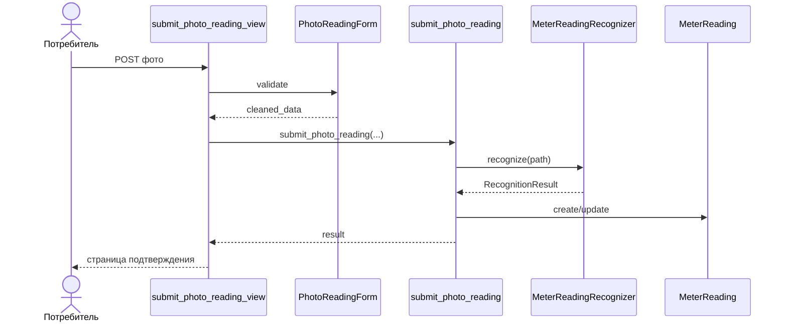

# EnergoCheck — мастер-промт для GitHub Copilot в VS Code

> Цель: на основании этого документа поэтапно создать полностью работоспособное web-приложение **EnergoCheck** для учебного проекта по автоматизации учета электроэнергии и работы с потребителями.
>
> Язык пользовательского интерфейса, пользовательских сообщений, документации и кратких комментариев в коде — **русский**. Имена классов, функций, переменных, модулей и файлов Python — **английские**, по общепринятым соглашениям Python/Django.
>
> Мобильное приложение **не разрабатывается в этом репозитории**. Web-приложение должно быть спроектировано так, чтобы бизнес-логика в будущем могла быть переиспользована мобильным клиентом через отдельный API без переписывания доменной логики.

---

## 0. Твоя роль и обязательный режим работы

Ты работаешь как автономный senior-разработчик Python/Django, системный аналитик, архитектор, тестировщик и DevOps-инженер в рамках одного учебного проекта. Не пытайся за один шаг сгенерировать весь проект. Выполняй работу **последовательными техническими блоками**, описанными ниже.

Перед изменением кода каждого блока:

1. Прочитай этот документ полностью.
2. Изучи текущее состояние репозитория, существующие файлы, миграции, тесты и историю Git.
3. Проверь, что работа ведется в правильной ветке.
4. Составь короткий план только текущего блока.
5. Реализуй блок.
6. Запусти форматирование, линтер, системные проверки Django, миграционные проверки и тесты, относящиеся к блоку.
7. Исправь найденные ошибки.
8. Покажи краткое резюме измененных файлов и результатов проверок.
9. Сделай **один содержательный коммит на русском языке**, описывающий завершенный технический блок.
10. Если remote `origin` настроен и доступен, отправь коммит в ветку `dev`.

Не создавай коммит, если тесты текущего блока падают или приложение не запускается.

Не выполняй без отдельного подтверждения пользователя:

- `git push --force` или `--force-with-lease`;
- удаление веток;
- сброс истории Git;
- удаление или пересоздание рабочей базы данных с потерей данных;
- удаление миграций, уже попавших в Git;
- публикацию секретов;
- создание или изменение удаленного GitHub-репозитория, если это может затронуть уже существующие данные;
- подключение сторонней библиотеки с сильной copyleft-лицензией (GPL/AGPL), если ее лицензионные обязательства не были отдельно согласованы.

Если возникает несущественная неоднозначность, выбирай наиболее простое, поддерживаемое и объяснимое решение, соответствующее этому документу. Задавай вопрос пользователю только если без ответа существует реальный риск испортить репозиторий, потерять данные, нарушить лицензию или существенно изменить функциональные требования.

---

# 1. Исходные данные проекта

## 1.1 Название

- Приложение: **EnergoCheck**
- Предполагаемый GitHub owner: `nolik843-cmyk`
- Предполагаемый remote: `https://github.com/nolik843-cmyk/EnergoCheck`

Если удаленный репозиторий еще не существует, **не придумывай его состояние**. Подготовь локальный репозиторий и попроси пользователя создать/подтвердить GitHub-репозиторий или явно разрешить его создание через GitHub CLI.

## 1.2 Предметная область

EnergoCheck — многоуровневая информационная система для энергоснабжающей организации. В рамках данного репозитория реализуется только web-часть системы.

Система автоматизирует:

- учет потребителей;
- учет договоров энергоснабжения;
- учет объектов потребления;
- учет приборов учета;
- ручную передачу показаний;
- распознавание показаний по фотографии счетчика;
- имитацию автоматического получения фотографий приборов учета;
- выявление аномалий потребления;
- тарифы и начисления;
- формирование счетов и квитанций;
- учебную имитацию оплаты без реальной банковской системы;
- задолженность и уведомления;
- акты сверки;
- заявки на технологическое присоединение;
- простую ML-рекомендацию требуемой мощности для заявки на технологическое присоединение;
- объекты распределительной сети и ремонты;
- отчеты по потреблению, платежам, нагрузкам и потерям;
- простое прогнозирование будущего потребления/баланса.

## 1.3 Бизнес-роли

В системе **ровно две бизнес-роли**:

1. `CONSUMER` — потребитель электроэнергии.
2. `EMPLOYEE` — работник энергоснабжающей организации.

Отдельной бизнес-роли `ADMIN` **нет**.

Django `superuser` допускается только как техническая учетная запись разработчика/сопровождения и не считается бизнес-ролью. Не показывай ее в пользовательской матрице ролей и не строй вокруг нее бизнес-процессы.

---

# 2. Технологический стек и базовые версии

Перед началом реализации проверь официальную документацию и актуальные стабильные версии. Не используй beta/dev-релизы, если это не согласовано отдельно.

Базовая точка на 16.09.2026:

- Python: **3.14.x**, использовать последний стабильный micro-release, доступный на момент запуска; базовая проверенная версия — 3.14.7.
- Django: **6.1.x**, использовать последний стабильный patch release; на 16.09.2026 актуален 6.1.1.
- PostgreSQL: **18.x**, стабильная ветка; на 16.09.2026 актуальна документация 18.6.
- Bootstrap: **5.3.x**, текущая стабильная major/minor ветка; базовая версия 5.3.8.
- htmx: **2.0.x**, базовая версия 2.0.10.
- psycopg: последняя стабильная версия 3.x, совместимая с выбранными Python/Django/PostgreSQL.
- Pillow — загрузка и валидация изображений.
- OpenCV — предобработка фотографий счетчиков.
- scikit-learn — ML для аномалий, оценки требуемой мощности и прогноза.
- joblib — сохранение обученных моделей scikit-learn.
- EasyOCR — предпочтительный первый кандидат для распознавания цифр на фотографиях приборов учета, если он проходит проверку совместимости и качества.
- ReportLab — формирование PDF документов с поддержкой кириллицы через Unicode-шрифт с совместимой лицензией.
- openpyxl — экспорт табличных отчетов в XLSX, если такой экспорт реализуется.
- pytest + pytest-django — тесты.
- Ruff — линтинг и форматирование.
- Docker Compose — воспроизводимый запуск PostgreSQL и, на финальном этапе, всего приложения.

### Строго запрещено для web-интерфейса

Не использовать React, Vue, Angular, Svelte и другой SPA-фреймворк. Не вводить Node.js/npm как обязательное условие разработки web-приложения.

### Frontend

Использовать:

- Django Templates;
- Bootstrap;
- htmx;
- минимальный vanilla JavaScript только там, где без него неоправданно сложно;
- Chart.js допустим исключительно для графиков и не должен превращать проект в SPA.

### Почему такой стек

Главная цель — минимизировать объем frontend-кода и сохранить основную бизнес-логику на Python. Интерфейс должен выглядеть аккуратно и современно, но не за счет сложной frontend-архитектуры.

---

# 3. Официальные источники, которым нужно следовать

При выборе API, настроек и паттернов сначала используй официальную документацию. Не копируй устаревшие решения из случайных статей и Stack Overflow, если официальная документация говорит иначе.

Обязательные источники:

- Python 3.14: https://docs.python.org/3.14/
- PEP 8: https://peps.python.org/pep-0008/
- Django 6.1: https://docs.djangoproject.com/en/6.1/
- Django security: https://docs.djangoproject.com/en/6.1/topics/security/
- Django testing: https://docs.djangoproject.com/en/6.1/topics/testing/
- Django migrations: https://docs.djangoproject.com/en/6.1/topics/migrations/
- Django transactions: https://docs.djangoproject.com/en/6.1/topics/db/transactions/
- Django deployment checklist: https://docs.djangoproject.com/en/6.1/howto/deployment/checklist/
- PostgreSQL 18: https://www.postgresql.org/docs/18/
- Bootstrap 5.3: https://getbootstrap.com/docs/5.3/
- htmx 2.x: https://htmx.org/docs/
- Ruff: https://docs.astral.sh/ruff/
- pytest: https://docs.pytest.org/
- scikit-learn: https://scikit-learn.org/stable/
- OpenCV: https://docs.opencv.org/
- EasyOCR GitHub: https://github.com/JaidedAI/EasyOCR
- GitHub Copilot custom instructions: https://docs.github.com/en/copilot/how-tos/configure-custom-instructions-in-your-ide/add-repository-instructions-in-your-ide
- VS Code custom agents: https://code.visualstudio.com/docs/agent-customization/custom-agents
- GitHub documentation: https://docs.github.com/

До добавления любой внешней ML-модели или фрагмента чужого кода проверь лицензию репозитория и зафиксируй источник в `THIRD_PARTY_NOTICES.md`.

---

# 4. Git и GitHub — обязательный процесс

## 4.1 Ветки

В проекте используются ровно три основные ветки:

- `main` — только первоначальная инициализация репозитория;
- `dev` — вся текущая разработка;
- `prod` — только законченные и проверенные версии приложения.

После создания стартового каркаса на `main` обычную разработку в `main` не вести.

## 4.2 Первичная инициализация

Если репозиторий пустой:

1. Инициализируй структуру репозитория на `main`.
2. Добавь минимальные файлы:
   - `README.md`;
   - `.gitignore`;
   - `.env.example`;
   - `.github/copilot-instructions.md`;
   - базовую структуру документации;
   - базовый `pyproject.toml` для Ruff;
   - файлы зависимостей.
3. Выполни первый коммит:
   - `Инициализация: создан каркас проекта EnergoCheck`
4. Создай от `main` ветки `dev` и `prod`.
5. Переключись на `dev`.
6. Все последующие технические блоки реализуй в `dev`.

## 4.3 Коммиты

После каждого завершенного технического блока обязательный коммит на русском языке.

Рекомендуемый формат:

`<Категория>: <что сделано>`

Примеры:

- `Инфраструктура: настроены Django и PostgreSQL`
- `Авторизация: добавлены роли потребителя и работника`
- `Показания: реализована ручная передача данных счетчика`
- `ML: добавлено распознавание показаний по фотографии`
- `Начисления: реализован расчет счетов по тарифам`
- `Оплата: добавлена учебная имитация платежа`
- `Уведомления: добавлены напоминания о сроке оплаты и задолженности`
- `Техприсоединение: добавлена ML-рекомендация мощности`
- `Отчеты: добавлены баланс, потери и эффективность платежей`
- `Документация: описаны бизнес-процессы и сетка вызовов функций`
- `Релиз: подготовлена стабильная версия EnergoCheck 1.0`

Не делай бессодержательные коммиты вида `fix`, `changes`, `update`, `работает`.

Перед каждым коммитом выполнить минимум:

```text
ruff check .
ruff format --check .
python manage.py check
python manage.py makemigrations --check --dry-run
pytest
```

Если полный `pytest` на позднем этапе занимает слишком долго, в рамках текущего блока можно сначала запускать адресные тесты, но перед релизом обязателен полный набор.

## 4.4 Переход в prod

В `prod` не разрабатывать.

Когда версия полностью готова:

1. Убедись, что `dev` чистая и синхронизирована.
2. Запусти полный CI/локальный quality gate.
3. Сформируй release checklist.
4. Создай PR `dev -> prod` либо, если PR недоступен, попроси пользователя подтвердить merge.
5. После принятия в `prod` поставь тег `v1.0.0`.
6. `main` не использовать как release-ветку.

---

# 5. Общие правила кода

## 5.1 Стиль

- Соблюдай PEP 8.
- Используй Ruff для форматирования и линтинга.
- Максимально используй type hints в прикладных сервисах и ML-адаптерах.
- Функции и методы должны выполнять одну понятную задачу.
- Не создавай функции на сотни строк.
- Не дублируй бизнес-правила во views, forms, templates и моделях одновременно.
- Магические числа выноси в настройки, константы или бизнес-политику.
- Денежные значения всегда считать через `Decimal`, никогда через `float`.
- Показания и кВт·ч хранить через `DecimalField` с достаточной точностью.
- Использовать timezone-aware datetime через Django timezone utilities.
- Использовать database constraints и indexes там, где это выражает реальные инварианты.

## 5.2 Комментарии

Краткие комментарии в коде писать **на русском языке** и только для объяснения назначения технического блока, неочевидной причины или важного ограничения.

Хороший пример:

```python
# Не создаем повторное напоминание для одного и того же расчетного события.
```

Плохой пример:

```python
# Увеличиваем i на 1.
```

Docstring для сложных публичных сервисов можно писать на русском языке. Имена API Python оставлять английскими.

## 5.3 Clean Architecture — прагматичная реализация

Использовать модульный монолит. Не разбивать учебный проект на микросервисы.

Разделять ответственность на уровни:

1. **Presentation** — Django views, forms, templates, htmx endpoints.
2. **Application** — use cases / services, координация бизнес-процессов.
3. **Domain** — модели предметной области, инварианты, enums, чистые вычисления.
4. **Infrastructure** — PostgreSQL/Django ORM, файловое хранилище, ML adapters, PDF, scheduler, внешние библиотеки.

Django view должна быть тонкой:

- принять HTTP-запрос;
- проверить права;
- валидировать форму;
- вызвать application service;
- вернуть response.

Сложная бизнес-логика не должна жить в template или view.

Для проекта использовать практический паттерн:

- `services.py` — команды/изменения состояния;
- `selectors.py` — сложные read-only запросы;
- `forms.py` — валидация входа от пользователя;
- `models.py` — данные, связи, локальные инварианты;
- `policies.py` при необходимости — вычислимые бизнес-правила без I/O;
- `integrations/` — сторонние ML и генераторы документов.

Не создавай искусственный слой `Repository` поверх Django ORM только ради формального соответствия Clean Architecture. Если он не дает реальной пользы — не вводи лишний шаблонный код.

## 5.4 Транзакции

Оборачивай в `transaction.atomic()` операции, где несколько изменений должны пройти как единое целое, например:

- создание платежа + пересчет статуса счета;
- формирование счета;
- подтверждение показания и запуск связанных расчетов;
- выдача технических условий;
- массовое начисление.

Используй `select_for_update()` там, где возможно конкурентное изменение финансового состояния счета.

---

# 6. Предлагаемая структура проекта

Сохраняй структуру компактной. Допускается разумное уточнение имен, но не объединяй все в одно приложение Django.

```text
EnergoCheck/
├── manage.py
├── config/
│   ├── settings/
│   │   ├── base.py
│   │   ├── dev.py
│   │   └── prod.py
│   ├── urls.py
│   └── wsgi.py / asgi.py
├── core/
├── accounts/
├── consumers/
├── metering/
├── billing/
├── payments/
├── notifications/
├── connections/
├── repairs/
├── analytics/
├── reports/
├── integrations/
│   ├── meter_ocr/
│   ├── ml/
│   └── documents/
├── templates/
│   ├── base/
│   ├── consumer/
│   └── employee/
├── static/
├── media/
├── docs/
├── scripts/
├── tests/              # только общесистемные/сквозные тесты; app tests рядом с app
├── .github/
│   ├── workflows/
│   └── copilot-instructions.md
├── pyproject.toml
├── requirements.txt
├── requirements-dev.txt
├── .env.example
├── docker-compose.yml
├── Dockerfile
├── README.md
└── THIRD_PARTY_NOTICES.md
```

Каждое доменное Django-приложение должно по возможности иметь:

```text
app_name/
├── models.py
├── enums.py
├── forms.py
├── services.py
├── selectors.py
├── views.py
├── urls.py
├── admin.py          # только техническая поддержка, не бизнес-роль
├── migrations/
└── tests/
    ├── test_models.py
    ├── test_services.py
    ├── test_views.py
    └── ...
```

Если файл становится слишком большим, разбивай его по предметным модулям, например `services/billing.py`, `services/reconciliation.py`.

---

# 7. Конфигурация приложения

## 7.1 Settings

Использовать разделенные настройки `base/dev/prod` или эквивалентную понятную схему.

Из переменных окружения получать как минимум:

- `DJANGO_SECRET_KEY`
- `DJANGO_DEBUG`
- `DJANGO_ALLOWED_HOSTS`
- `DJANGO_CSRF_TRUSTED_ORIGINS`
- `POSTGRES_DB`
- `POSTGRES_USER`
- `POSTGRES_PASSWORD`
- `POSTGRES_HOST`
- `POSTGRES_PORT`
- `METER_OCR_BACKEND`
- `METER_OCR_MODEL_PATH`
- `METER_OCR_CONFIDENCE_THRESHOLD`
- `ML_MODELS_DIR`
- `DEMO_PAYMENT_MODE`
- `APP_TIME_ZONE`

`.env` всегда в `.gitignore`. В Git хранится только `.env.example` без секретов.

## 7.2 PostgreSQL

PostgreSQL — основная и единственная целевая СУБД. Не проектируй приложение под особенности SQLite.

В CI желательно также поднимать PostgreSQL service, чтобы тестировать реальную целевую СУБД.

## 7.3 Локальные файлы

В учебной версии допустимо хранить фотографии и генерируемые PDF в локальном `media/`.

Не хранить пользовательские загрузки в Git.

---

# 8. Пользовательский интерфейс

Весь сайт должен быть на русском языке.

## 8.1 Общий стиль

- аккуратный Bootstrap 5;
- светлая нейтральная тема;
- адаптивная верстка;
- читаемые таблицы;
- формы с подписями;
- единообразные badges для статусов;
- breadcrumbs там, где они реально помогают;
- понятные empty states;
- русские сообщения валидации;
- подтверждение опасных действий;
- обязательная пагинация длинных таблиц;
- фильтры через GET-параметры;
- удобная навигация с учетом роли.

## 8.2 Потребительское меню

Минимум:

- Главная
- Мой договор
- Приборы учета
- Передать показания
- История показаний
- Счета и начисления
- Оплата
- Уведомления
- Технологическое присоединение
- Профиль

## 8.3 Меню работника

Минимум:

- Панель работника
- Потребители
- Договоры
- Объекты потребления
- Приборы учета
- Показания
- Распознавание/очередь проверки
- Аномалии
- Тарифы
- Начисления и счета
- Платежи и задолженность
- Акты сверки
- Технологическое присоединение
- Объекты сети
- Ремонты
- Отчеты
- Прогнозы

## 8.4 htmx

Использовать htmx для небольших интерактивных операций:

- пометить уведомление прочитанным;
- обновить статус заявки;
- фильтровать/обновлять часть таблицы;
- подтвердить распознанное показание;
- подгрузить модальное окно;
- обновить блок баланса после демонстрационной оплаты.

Не делай сложную клиентскую state-machine. Сервер остается источником истины.

---

# 9. Авторизация и права доступа

## 9.1 Custom User

Сразу создать собственную модель пользователя на основе `AbstractUser`, чтобы не менять `AUTH_USER_MODEL` после первых миграций.

Добавить поле `role` с choices:

- `CONSUMER`
- `EMPLOYEE`

## 9.2 Разграничение доступа

Потребитель:

- видит только свои данные;
- не может менять тарифы/договоры;
- не может видеть других потребителей;
- не может подтверждать служебные операции работника.

Работник:

- работает со всеми бизнес-данными организации;
- может создавать/редактировать потребителей, договоры и приборы учета;
- подтверждает спорные показания;
- управляет тарифами;
- выполняет начисления;
- обрабатывает заявки;
- ведет ремонты;
- строит отчеты.

Права должны проверяться на сервере. Скрытая кнопка в template не является защитой.

## 9.3 Регистрация потребителя

Для учебной версии предпочтителен безопасный сценарий:

1. Работник заранее создает карточку потребителя и договор с уникальным лицевым счетом.
2. Потребитель на странице регистрации вводит:
   - лицевой счет;
   - номер договора;
   - email;
   - пароль.
3. Application service проверяет совпадение незанятой карточки потребителя и договора.
4. Создается `User(role=CONSUMER)` и связывается с карточкой потребителя.
5. Повторная привязка к уже активированной карточке запрещена.

Если этот сценарий неоправданно усложняет первую рабочую итерацию, сначала реализуй создание учетной записи работником, но архитектуру оставь готовой к self-activation.

---

# 10. Модель данных

Точные названия можно слегка уточнить, но смысл и связи сохранять.

## 10.1 User

Основные поля:

- стандартные поля `AbstractUser`;
- `role`;
- при необходимости `phone`.

## 10.2 Consumer

- `user` — nullable OneToOne к User до активации;
- `personal_account_number` — уникальный лицевой счет;
- `full_name`;
- `email`;
- `phone`;
- `created_at`;
- `is_active`.

## 10.3 SupplyObject

Объект потребления:

- consumer;
- address;
- object_type;
- area_m2;
- residents_count;
- status.

## 10.4 Contract

- consumer;
- supply_object;
- number — unique;
- start_date;
- end_date nullable;
- status: ACTIVE / SUSPENDED / CLOSED;
- created_at.

## 10.5 Meter

- supply_object;
- serial_number — unique;
- model_name;
- meter_type;
- install_date;
- commissioning_reading;
- multiplier;
- phase_count;
- status: ACTIVE / REPLACED / RETIRED;
- replaced_by nullable self-reference при необходимости.

## 10.6 MeterReading

- meter;
- value `DecimalField`;
- reading_at;
- source:
  - MANUAL
  - PHOTO
  - CAMERA
  - EMPLOYEE
- status:
  - PENDING_CONFIRMATION
  - PENDING_REVIEW
  - CONFIRMED
  - REJECTED
- photo nullable;
- recognized_value nullable;
- recognition_confidence nullable;
- recognition_model_version nullable;
- entered_by nullable;
- reviewed_by nullable;
- review_comment;
- created_at;
- confirmed_at nullable.

Бизнес-проверки:

- обычное новое показание не должно быть меньше последнего подтвержденного, если не зафиксирована замена счетчика;
- дубликаты должны обрабатываться предсказуемо;
- слишком резкое изменение не блокировать молча, а отправлять на проверку/анализ аномалий;
- расчет потребления всегда строить по подтвержденным показаниям.

## 10.7 Tariff

- name;
- price_per_kwh Decimal;
- valid_from;
- valid_to nullable;
- is_active.

Тарифы не перезаписывать задним числом. Старые версии сохранять.

Не допускать неоднозначного перекрытия периодов действия для одного типа тарифа. Проверить это в сервисе и тестах.

## 10.8 Invoice

- contract;
- period_start;
- period_end;
- previous_reading;
- current_reading;
- consumption_kwh;
- tariff_name_snapshot;
- price_per_kwh_snapshot;
- amount;
- due_date;
- status:
  - DRAFT
  - ISSUED
  - PARTIALLY_PAID
  - PAID
  - OVERDUE
- issued_at;
- created_at.

Unique constraint: один основной счет на договор/расчетный период.

## 10.9 Payment

- invoice;
- amount;
- paid_at;
- status: SUCCESS / FAILED;
- method: DEMO;
- demo_reference;
- created_by;
- created_at.

**Никогда не хранить** номер банковской карты, CVV/CVC или реальные платежные реквизиты.

## 10.10 Notification

- consumer;
- type:
  - PAYMENT_DUE_SOON
  - DEBT_REMINDER
  - APPLICATION_STATUS
  - READING_RESULT
- title;
- message;
- created_at;
- read_at nullable;
- related_invoice nullable;
- related_application nullable;
- `dedup_key` — уникальный ключ события для идемпотентности.

## 10.11 ConsumptionAnomaly

- consumer/meter;
- reading nullable;
- period;
- anomaly_score;
- anomaly_type;
- description;
- model_version;
- status: NEW / REVIEWING / CONFIRMED / REJECTED;
- detected_at;
- reviewed_by nullable;
- review_comment.

## 10.12 ConnectionApplication

Заявка на технологическое присоединение:

- consumer;
- address/object description;
- object_type;
- area_m2;
- residents_count;
- electric_stove bool;
- electric_heating bool;
- electric_water_heater bool;
- air_conditioners_count;
- ev_charger bool;
- declared_equipment_power_kw;
- requested_power_kw;
- ml_recommended_power_kw nullable;
- ml_model_version nullable;
- status: DRAFT / SUBMITTED / IN_REVIEW / NEEDS_INFO / APPROVED / REJECTED / COMPLETED;
- employee_comment;
- submitted_at;
- reviewed_at.

## 10.13 TechnicalCondition

- application OneToOne;
- number;
- approved_power_kw;
- issued_at;
- valid_until nullable;
- text/body;
- pdf_file nullable.

ML дает рекомендацию, но **не принимает решение автоматически**. Работник может изменить рекомендованную мощность и обязан иметь возможность оставить комментарий.

## 10.14 NetworkObject

- name;
- object_type;
- location_description;
- nominal_capacity;
- status.

## 10.15 Repair

- network_object;
- source_anomaly nullable;
- title;
- description;
- priority;
- planned_start;
- actual_start nullable;
- actual_end nullable;
- status: NEW / PLANNED / IN_PROGRESS / COMPLETED / CLOSED;
- result_comment;
- responsible_employee nullable.

## 10.16 EnergyBalance

- period_start;
- period_end;
- incoming_energy_kwh — вводится работником/имитируется;
- consumed_energy_kwh — рассчитывается по подтвержденным данным;
- losses_kwh;
- losses_percent;
- generated_at.

## 10.17 ForecastRecord

- scope_type;
- scope_id/reference;
- target_period;
- predicted_consumption_kwh;
- model_version;
- generated_at.

---

# 11. Бизнес-процесс: ручная передача показаний

## 11.1 Потребитель

Сценарий:

1. Пользователь открывает «Передать показания».
2. Видит активные счетчики и последние подтвержденные показания.
3. Выбирает счетчик.
4. Вводит новое значение и дату.
5. Django Form выполняет синтаксическую валидацию.
6. `metering.services.submit_manual_reading()` выполняет бизнес-валидацию.
7. Если значение корректно и не требует проверки, создается/подтверждается показание.
8. Если значение подозрительное, показание получает `PENDING_REVIEW`.
9. После подтвержденного показания запускается анализ аномалий или ставится задача на него.
10. Пользователь получает понятное русское сообщение.

## 11.2 Работник

Работник видит очередь `PENDING_REVIEW`, контекст:

- потребитель;
- прибор;
- прошлое значение;
- новое значение;
- разница;
- дата;
- источник;
- ML anomaly score, если доступен.

Работник может подтвердить или отклонить с комментарием.

---

# 12. Бизнес-процесс: распознавание показаний по фотографии

## 12.1 Общая архитектура

Не связывать доменную логику напрямую с конкретной OCR-библиотекой.

Создать интерфейс/Protocol уровня integrations:

```text
MeterReadingRecognizer.recognize(image_path) -> RecognitionResult
```

`RecognitionResult` должен содержать как минимум:

- распознанное числовое значение;
- confidence 0..1;
- сырую строку результата;
- имя/версию backend модели;
- диагностическую информацию без персональных данных.

## 12.2 Предпочтительная open-source реализация

Сначала оценить **EasyOCR** (`JaidedAI/EasyOCR`, Apache-2.0) как готовое open-source решение.

Pipeline:

1. Проверить тип и размер файла.
2. Открыть изображение Pillow/OpenCV.
3. Исправить ориентацию при необходимости.
4. Выполнить мягкую предобработку:
   - grayscale;
   - contrast/CLAHE при необходимости;
   - denoise;
   - adaptive threshold только если реально повышает качество.
5. EasyOCR читать с ограничением символов:
   - `0123456789.,`
6. Найти наиболее вероятный цифровой блок.
7. Нормализовать десятичный разделитель.
8. Вернуть значение и confidence.
9. Показать результат пользователю для подтверждения.

Не «додумывать» цифры при низкой уверенности.

## 12.3 Специализированная модель счетчика

Разрешается изучить `https://github.com/NirKli/WattBot` как специализированный пример распознавания электрических счетчиков.

Перед копированием кода/весов:

1. Проверить актуальный commit.
2. Проверить `LICENSE`.
3. Проверить лицензии runtime-зависимостей.
4. Не переносить чужой React/FastAPI код целиком.
5. Использовать только ту часть, которая реально улучшает распознавание.
6. Внести атрибуцию в `THIRD_PARTY_NOTICES.md`.

Важно: если специализированное решение тянет AGPL/GPL runtime и это создает лицензионные обязательства для EnergoCheck, **не подключать его молча**. Сообщить пользователю и запросить подтверждение либо использовать более permissive вариант.

## 12.4 Поведение интерфейса

После загрузки фото:

- показать превью;
- показать «Распознано: 12345.6»;
- показать простую оценку уверенности;
- дать возможность исправить число;
- кнопки «Подтвердить» и «Отмена».

При confidence ниже настраиваемого порога либо при логической аномалии после подтверждения пользователем переводить запись в `PENDING_REVIEW`.

## 12.5 Тестируемость

В тестах не загружать тяжелую ML-модель в каждом тесте.

Создать fake/mock recognizer. Интеграционный тест реального OCR пометить отдельно (`@pytest.mark.ml`), чтобы базовый test suite оставался быстрым.

---

# 13. Бизнес-процесс: имитация автоматического сбора фотографий

Реальных счетчиков/камер в учебной версии нет. Нужно показать бизнес-процесс автоматически поступающих фотографий без физического оборудования.

Реализовать management command, например:

```text
python manage.py ingest_meter_photos <folder>
```

Правила:

- имя файла содержит серийный номер счетчика и дату либо рядом есть JSON metadata;
- command находит Meter;
- запускает `MeterReadingRecognizer`;
- создает `MeterReading(source=CAMERA)`;
- при хорошем confidence и корректном значении может переводить в CONFIRMED согласно явной политике;
- при сомнении — PENDING_REVIEW;
- command идемпотентен: повторный импорт того же файла не создает дубль;
- сохранять checksum исходного файла или уникальный import id.

Подготовить небольшой набор demo-фотографий или инструкции, куда пользователь может положить свои изображения. Не хранить чужие защищенные авторским правом датасеты без лицензии.

---

# 14. Бизнес-процесс: ML-детекция аномалий потребления

Использовать простой объяснимый подход на scikit-learn.

Базовая модель: `IsolationForest`.

## 14.1 Признаки

Минимальный набор, рассчитываемый из подтвержденных показаний:

- consumption_kwh за период;
- абсолютное изменение к предыдущему периоду;
- процентное изменение;
- rolling mean 3 периода;
- rolling mean 6 периодов при наличии;
- отклонение от rolling mean;
- месяц года;
- число дней в периоде/нормализованное среднесуточное потребление.

## 14.2 Обучение

Management command:

```text
python manage.py train_anomaly_model
```

- брать только корректные подтвержденные исторические данные;
- использовать фиксированный `random_state`;
- версионировать модель;
- сохранять через joblib в каталог моделей, не в БД;
- в БД хранить только model version и результаты.

Если данных недостаточно, не выдавать ложную «ML-оценку». Показывать «Недостаточно данных для модели».

`seed_demo_data` должен генерировать достаточно истории, чтобы ML можно было продемонстрировать.

## 14.3 Результат

`detect_consumption_anomaly()` возвращает:

- `is_anomaly`;
- `score`;
- model_version;
- короткое объяснение на основе признаков, например «потребление значительно выше среднего за 3 месяца».

Не утверждать, что ML доказал утечку/хищение. Формулировка UI: «Обнаружено нетипичное потребление, требуется проверка».

---

# 15. Бизнес-процесс: тарифы и начисления

## 15.1 Тарифы

Работник может:

- создать тариф;
- указать стоимость кВт·ч;
- указать период действия;
- завершить действие тарифа;
- просмотреть историю.

Не изменять старый тариф так, чтобы пересчитались исторические счета.

## 15.2 Расчет счета

Application service, например:

```text
billing.services.generate_invoice(contract, period_start, period_end)
```

Шаги:

1. Найти действующий договор.
2. Найти подтвержденные показания на начало/конец периода по активному прибору.
3. Рассчитать расход.
4. Выбрать тариф, действующий для расчетного периода.
5. Скопировать имя/цену тарифа в snapshot-поля счета.
6. Рассчитать сумму `Decimal`.
7. Назначить `due_date`.
8. Создать `Invoice` идемпотентно.
9. Не создавать второй счет для того же договора/периода.
10. После ISSUE подготовить события уведомлений.

Пакетное начисление работником:

```text
billing.services.generate_invoices_for_period(...)
```

Показывать результат: успешно создано / пропущено / ошибки с причинами.

---

# 16. Бизнес-процесс: счета, квитанции и PDF

Потребитель:

- видит список счетов;
- открывает детализацию;
- скачивает счет/квитанцию PDF.

Работник:

- видит счета всех потребителей;
- фильтрует по периоду, статусу, задолженности;
- может повторно сформировать документ без изменения финансового результата.

PDF строить отдельным adapter/service, не во view.

Документ содержит:

- название EnergoCheck / энергоснабжающей организации (учебное);
- потребителя;
- лицевой счет;
- договор;
- период;
- прошлое/текущее показание;
- расход;
- тариф;
- начислено;
- оплачено;
- остаток;
- due date.

Кириллица должна корректно отображаться.

---

# 17. Бизнес-процесс: учебная имитация оплаты

Реальной банковской системы **нет** и не должно быть.

Страница обязательно явно помечена:

> «Учебная имитация оплаты. Реальные банковские операции не выполняются.»

## 17.1 Безопасный учебный сценарий

Предпочтительно не собирать реальные карточные реквизиты вообще.

Показать:

- номер счета;
- сумму к оплате;
- кнопку «Оплатить (демо)»;
- при необходимости отдельный переключатель/кнопку для демонстрации ошибки оплаты только в DEBUG/demo режиме.

После успешной имитации:

1. В transaction atomic заблокировать счет на обновление.
2. Проверить оставшуюся задолженность.
3. Создать `Payment(method=DEMO, status=SUCCESS)`.
4. Пересчитать статус Invoice.
5. Обновить задолженность.
6. Не допустить двойной оплаты одного остатка при двойном клике/повторном POST.
7. Создать demo reference.
8. Вернуть русский success message.

Если реализуется форма, визуально похожая на банковскую, не сохранять и не логировать номер карты/CVV.

---

# 18. Бизнес-процесс: задолженность и уведомления

У потребителя есть отдельный раздел «Уведомления» и badge непрочитанных сообщений.

## 18.1 Уведомление перед сроком оплаты

Правило:

- если счет еще не оплачен;
- за **3 календарных дня до `due_date`**;
- создать ровно одно уведомление `PAYMENT_DUE_SOON`.

Пример русского текста:

> «Напоминаем: срок оплаты счета №... наступает 20.09.2026. К оплате: ... руб.»

## 18.2 Напоминание о задолженности

После наступления просрочки:

- если остаток долга > 0;
- первое напоминание через 14 дней после даты возникновения задолженности;
- затем каждые 14 дней;
- после полного погашения новые напоминания не создавать.

Идемпотентность обязательна. Повторный запуск scheduler в тот же день не должен создавать копии.

Удобный способ: deterministic `dedup_key`, например комбинация invoice/event/date interval.

## 18.3 Scheduler

Не запускай APScheduler внутри каждого web worker.

Сделай отдельный management command/процесс scheduler, например:

```text
python manage.py run_scheduler
```

Он может вызывать idempotent services:

- `notifications.services.create_due_soon_notifications()`
- `notifications.services.create_debt_reminders()`
- при необходимости периодические analytics jobs.

В Docker Compose scheduler запускается отдельным service/process.

Для тестов каждый сервис вызывается напрямую без ожидания реального времени.

---

# 19. Бизнес-процесс: взаиморасчеты и акт сверки

Работник выбирает:

- потребителя;
- начало периода;
- конец периода.

Система рассчитывает:

- входящее сальдо;
- начисления;
- платежи;
- исходящее сальдо.

Application service должен возвращать DTO/структуру данных, не HTML.

На основании результата:

- отображается web-страница;
- формируется PDF «Акт сверки взаиморасчетов».

Тесты должны проверять арифметику с Decimal и частичной оплатой.

---

# 20. Бизнес-процесс: технологическое присоединение

## 20.1 Потребитель

Подает заявку и указывает минимум:

- адрес/описание объекта;
- тип объекта;
- площадь;
- число проживающих/пользователей;
- наличие электроплиты;
- электрического отопления;
- электрического водонагревателя;
- количество кондиционеров;
- наличие зарядки электромобиля;
- суммарную мощность другого значимого оборудования;
- желаемую мощность.

Видит историю и текущий статус заявки.

## 20.2 Работник

- открывает заявку;
- видит исходные параметры;
- видит ML-рекомендацию мощности;
- принимает решение;
- может изменить мощность относительно рекомендации;
- оставляет комментарий;
- формирует технические условия;
- меняет статус.

## 20.3 Простая ML-модель для рекомендации мощности

Это **рекомендательная**, а не автоматическая разрешительная модель.

Базовый алгоритм: `RandomForestRegressor` или другой простой стабильный регрессор scikit-learn, если по метрикам он лучше и остается объяснимым.

Pipeline:

- numeric features;
- categorical `object_type` через OneHotEncoder;
- фиксированный random_state;
- train/test split;
- MAE и R² в отчете обучения;
- joblib model artifact;
- model version.

Команда:

```text
python manage.py train_connection_power_model
```

Источники данных:

1. Сначала найди на GitHub/открытых источниках permissively licensed релевантный набор/пример по оценке электрической нагрузки.
2. Проверяй лицензию.
3. Если надежного подходящего набора для учебной постановки нет, используй **явно помеченный синтетический демонстрационный датасет**, генерируемый воспроизводимым скриптом по прозрачным диапазонам признаков. Не выдавай его за реальные отраслевые данные.

В `docs/ML_MODELS.md` обязательно указать происхождение обучающих данных и ограничения.

ML никогда не должна автоматически менять статус заявки на APPROVED/REJECTED.

---

# 21. Бизнес-процесс: ремонты распределительной сети

Работник ведет объекты сети и ремонты.

Функции:

- создание NetworkObject;
- регистрация проблемы;
- создание Repair;
- назначение приоритета;
- планирование даты;
- переходы статуса;
- фиксация результата.

Допускается создать ремонт из подтвержденной аномалии/служебной проверки с заполненной ссылкой `source_anomaly`.

Статусные переходы централизовать в service/policy, а не размазывать по нескольким views.

---

# 22. Бизнес-процесс: отчеты

Работнику нужны фильтруемые отчеты.

## 22.1 Потребление

- по периоду;
- по потребителю;
- по прибору;
- суммарно;
- таблица + график.

## 22.2 Платежи

Показатели:

- начислено;
- оплачено;
- задолженность;
- коэффициент/процент сбора платежей.

## 22.3 Аномалии

- найдено;
- подтверждено;
- отклонено;
- по периодам.

## 22.4 Нагрузки

Агрегированное потребление по дням/месяцам.

## 22.5 Баланс и потери

Работник вводит/имитирует объем поступившей энергии за период.

Система:

```text
consumed = сумма учтенного подтвержденного потребления
losses = incoming - consumed
loss_percent = losses / incoming * 100
```

Корректно обработать `incoming = 0`.

## 22.6 Экспорт

Минимум — CSV. XLSX допустим через openpyxl.

Не генерируй Excel в view: отдельный document/export service.

---

# 23. Бизнес-процесс: прогноз потребления и баланса

Нужна простая демонстрационная ML-модель, а не сложная нейросеть.

Предпочтительный первый вариант:

- RandomForestRegressor / HistGradientBoostingRegressor;
- признаки lag1, lag2, lag3;
- rolling mean;
- month;
- days_in_month;
- при наличии — aggregated consumer count.

Команда обучения:

```text
python manage.py train_consumption_forecast_model
```

Команда/сервис прогноза:

```text
analytics.services.forecast_consumption(...)
```

Требования:

- не строить ML прогноз при недостатке данных;
- сохранять model version;
- показывать, что прогноз ориентировочный;
- для отчета по балансу можно прогнозировать ожидаемое потребление следующего периода и сравнивать с заданным ожидаемым поступлением.

---

# 24. Dashboard потребителя

После входа показывать компактно:

- ФИО и лицевой счет;
- текущий баланс/задолженность;
- ближайший срок оплаты;
- последний счет;
- последнее подтвержденное показание;
- кнопка «Передать показания»;
- график потребления за последние месяцы;
- последние 3–5 уведомлений;
- статус последней заявки на технологическое присоединение.

Не перегружать экран таблицами.

---

# 25. Dashboard работника

Показатели:

- число активных потребителей;
- показания, ожидающие проверки;
- новые аномалии;
- количество просроченных счетов;
- сумма текущей задолженности;
- заявки на технологическое присоединение в работе;
- активные ремонты;
- потребление за текущий период;
- эффективность сбора платежей.

Все показатели должны рассчитываться через selectors/analytics services.

---

# 26. Демо-данные

Создать idempotent management command:

```text
python manage.py seed_demo_data
```

Он должен создавать воспроизводимый учебный набор:

- 1 работника;
- минимум 5–10 потребителей;
- договоры;
- объекты;
- счетчики;
- тарифы;
- минимум 12–18 месяцев исторических показаний;
- несколько заранее заложенных аномалий;
- счета;
- часть оплаченных счетов;
- несколько просрочек;
- уведомления;
- заявки на технологическое присоединение;
- сетевые объекты и ремонты;
- данные входного баланса.

Использовать фиксированный random seed.

Пароли не хардкодить в исходниках. Получать demo password из env или аргумента command; если не передан, сгенерировать и вывести один раз в терминал.

---

# 27. ML-артефакты и лицензии

## 27.1 Общий интерфейс

Каждый ML-компонент должен иметь адаптер с понятным API и не протекать во views.

Пример:

```text
integrations/ml/
├── anomaly_detector.py
├── connection_power_estimator.py
├── consumption_forecaster.py
└── registry.py
```

## 27.2 Версионирование

Для каждой сохраненной модели фиксировать:

- имя;
- semantic/internal version;
- дату обучения;
- хэш файла;
- используемый dataset/source;
- список feature names;
- метрики;
- версию библиотек.

Хранить metadata JSON рядом с joblib/weights.

## 27.3 Git

Большие веса моделей не помещать в обычный Git бездумно.

Выбрать один подход:

- Git LFS; или
- скрипт воспроизводимой загрузки по зафиксированному источнику и checksum.

Если для Git LFS нужны дополнительные действия пользователя, сообщить об этом.

## 27.4 THIRD_PARTY_NOTICES

Файл должен содержать для каждого заимствованного компонента:

- название;
- URL;
- конкретную версию/commit, если применимо;
- лицензию;
- что именно используется;
- были ли изменения.

---

# 28. Безопасность — разумный уровень учебного проекта

Безопасность не должна поглотить основную трудоемкость, но базовые правила обязательны.

- использовать Django auth, не писать собственное хранение паролей;
- CSRF включен;
- XSS autoescape не отключать;
- не использовать `mark_safe` без реальной необходимости;
- object-level ownership проверять на сервере;
- загрузки ограничить по размеру;
- проверять изображения не только по расширению;
- случайные имена файлов/безопасные пути;
- секреты только через env;
- DEBUG false в prod;
- prod cookies/HTTPS settings подготовить согласно Django deployment checklist;
- не логировать пароли, demo payment data и лишние персональные данные;
- ORM использовать вместо ручной SQL-склейки строк;
- не отключать CSRF ради удобства HTMX;
- формы POST содержат csrf token;
- rate limiting не обязателен для курсовой, но архитектура не должна провоцировать очевидные DoS через неограниченные upload.

---

# 29. Тестирование

## 29.1 Обязательные типы тестов

### Unit/service tests

Проверить минимум:

- валидацию нового показания;
- расчет расхода;
- расчет счета;
- выбор тарифа по дате;
- повторное формирование счета не создает дубль;
- demo payment;
- двойной POST оплаты не создает лишний платеж;
- частичную оплату;
- due-soon уведомление;
- 14-дневные debt reminders;
- прекращение reminders после оплаты;
- акт сверки;
- переходы статусов заявки;
- рекомендации ML adapter через fake;
- ремонтные статусы;
- потери/баланс.

### Permission tests

Проверить:

- consumer не открывает employee URLs;
- consumer A не читает данные consumer B;
- employee имеет ожидаемый доступ;
- анонимный пользователь перенаправляется на login.

### View/integration tests

- формы;
- редиректы;
- HTMX partial responses;
- основные happy paths.

### ML tests

- быстрые unit тесты через fake/mock;
- отдельные медленные integration tests маркировать `ml`;
- smoke test обучения scikit-learn моделей на маленьком dataset.

## 29.2 Quality gate

Перед финальным merge в prod:

```text
ruff check .
ruff format --check .
python manage.py check
python manage.py check --deploy --settings=config.settings.prod
python manage.py makemigrations --check --dry-run
pytest
```

Также выполнить чистый запуск проекта с нуля по README.

---

# 30. CI GitHub Actions

Создать `.github/workflows/ci.yml`.

На push/PR для `dev` и `prod`:

1. checkout;
2. setup Python;
3. подъем PostgreSQL service;
4. установка dependencies;
5. Ruff check;
6. Ruff format --check;
7. Django check;
8. migrations check;
9. pytest.

Не запускать тяжелый реальный OCR model test на каждый commit, если это существенно замедляет CI. Его вынести в отдельный manual/optional workflow или использовать mock.

В финале добавить Docker build check.

---

# 31. Docker

Docker не должен мешать локальной разработке, но финальная версия должна иметь:

- `Dockerfile` web;
- PostgreSQL service;
- web service;
- scheduler service;
- volumes для PostgreSQL и media;
- healthcheck где разумно.

Не хранить prod secret в compose-файле.

README должен давать два сценария:

1. локальная Python-разработка + PostgreSQL Docker;
2. полный `docker compose up`.

---

# 32. Документация, обязательная к финалу

## 32.1 README.md

На русском языке.

Содержит:

- назначение;
- стек;
- системные требования;
- установка;
- `.env`;
- PostgreSQL;
- миграции;
- создание demo data;
- обучение ML-моделей;
- настройка OCR;
- запуск web;
- запуск scheduler;
- запуск тестов;
- запуск Docker;
- роли;
- структура каталогов;
- Git workflow;
- известные ограничения учебной версии.

## 32.2 docs/BUSINESS_PROCESSES.md

Подробно описать принципы работы основных бизнес-процессов:

1. авторизация и роли;
2. учет потребителей и договоров;
3. ручное показание;
4. фото + OCR;
5. автоматический import фото;
6. ML anomaly detection;
7. тарифы и начисления;
8. demo payment;
9. задолженность и уведомления;
10. акт сверки;
11. технологическое присоединение и ML-рекомендация;
12. ремонты;
13. отчетность;
14. баланс/потери;
15. прогнозирование.

Для каждого:

- инициатор;
- входные данные;
- проверки;
- основная последовательность;
- альтернативные ветки;
- какие сущности меняются;
- результат.

## 32.3 docs/FUNCTION_CALL_MAP.md

Это **обязательный отдельный файл «сетка вызовов функций»**.

Для каждой бизнес-логики должна быть таблица:

| Бизнес-процесс | URL/entrypoint | View | Form | Application service | Selectors/policies | Models | External adapter | Side effects | Tests |
|---|---|---|---|---|---|---|---|---|---|

После таблицы для каждого ключевого процесса добавить Mermaid call/sequence diagram с **реальными именами функций и файлов из итогового кода**.

Пример логики структуры, но имена должны соответствовать реальному проекту:



Документ должен позволять преподавателю/разработчику проследить вызов от страницы до функции бизнес-логики и БД.

## 32.4 docs/ARCHITECTURE.md

- слои;
- модули;
- схема зависимостей;
- почему выбран modular monolith;
- почему Django Templates + htmx;
- где проходит граница ML.

## 32.5 docs/DB_SCHEMA.md

Mermaid ER diagram и краткое описание ключевых связей.

## 32.6 docs/ML_MODELS.md

Для каждого ML-компонента:

- задача;
- алгоритм;
- source/data;
- лицензия внешнего компонента;
- features;
- training procedure;
- metrics;
- model artifact;
- limitations;
- как переобучить;
- как заменить adapter.

## 32.7 THIRD_PARTY_NOTICES.md

Все сторонние решения/модели/шрифты/код, для которых требуется атрибуция.

---

# 33. GitHub Copilot instructions

Создай `.github/copilot-instructions.md` и поддерживай его актуальным.

Он должен быть коротким по сравнению с этим master spec и содержать always-on правила:

- проект EnergoCheck;
- Python/Django/PostgreSQL;
- Templates + Bootstrap + htmx;
- русский UI и комментарии;
- две роли;
- thin views + services/selectors;
- Decimal для денег;
- tests + Ruff до commit;
- commit messages на русском;
- разработка в dev;
- mobile out of scope;
- не создавать React/Vue;
- читать `docs/PROJECT_SPEC.md` или этот master spec перед крупной задачей.

---

# 34. Пошаговые технические блоки разработки

Работай именно блоками. После каждого — проверки и коммит.

## Блок 0. Репозиторий и правила проекта

Сделать:

- Git initialization/remotes check;
- main/dev/prod;
- `.gitignore`;
- `.env.example`;
- `.github/copilot-instructions.md`;
- `docs/` skeleton;
- README skeleton;
- базовый Ruff config;
- dependency files.

Acceptance:

- ветки существуют;
- секретов нет;
- рабочее дерево чистое.

Коммит:

`Инициализация: создан каркас проекта EnergoCheck`

## Блок 1. Django + PostgreSQL

Сделать:

- Django project;
- settings base/dev/prod;
- PostgreSQL connection;
- base templates/static;
- health/home page;
- Docker PostgreSQL.

Acceptance:

- migrations проходят;
- `/` открывается;
- DB — PostgreSQL.

Коммит:

`Инфраструктура: настроены Django и PostgreSQL`

## Блок 2. Пользователи, роли, базовый layout

Сделать:

- custom User;
- roles;
- login/logout;
- role redirect;
- access mixins/decorators;
- consumer/employee base layouts;
- permission tests.

Коммит:

`Авторизация: добавлены роли потребителя и работника`

## Блок 3. Потребители, объекты, договоры, приборы учета

Сделать models/forms/services/views/templates/tests.

Работник получает CRUD с search/filter.

Потребитель получает read-only свои данные.

Коммит:

`Учет: добавлены потребители договоры и приборы учета`

## Блок 4. Ручные показания

- MeterReading;
- manual reading form;
- validation service;
- history;
- employee review queue;
- tests.

Коммит:

`Показания: реализована ручная передача и проверка данных`

## Блок 5. OCR по фотографии

- file validation;
- recognizer Protocol;
- EasyOCR/OpenCV adapter;
- preview/confirmation flow;
- confidence;
- mock adapter for tests;
- licensing docs.

Коммит:

`ML: добавлено распознавание показаний по фотографии`

## Блок 6. Автоматический import фото

- checksum/import metadata;
- management command;
- idempotency;
- camera source;
- tests.

Коммит:

`Показания: добавлена имитация автоматического сбора фотографий`

## Блок 7. ML аномалии

- feature builder;
- train command;
- joblib artifact;
- detection service;
- anomaly list/review;
- demo training data;
- tests.

Коммит:

`ML: реализована детекция аномалий потребления`

## Блок 8. Тарифы и начисления

- Tariff;
- Invoice;
- services;
- employee batch generation;
- consumer list/detail;
- tests Decimal/idempotency.

Коммит:

`Начисления: реализованы тарифы и формирование счетов`

## Блок 9. Demo payment

- Payment;
- payment page;
- transaction locking;
- status recalculation;
- duplicate protection;
- tests.

Коммит:

`Оплата: добавлена учебная имитация платежей`

## Блок 10. Уведомления и scheduler

- Notification;
- unread badge;
- due-soon 3 days;
- overdue every 14 days;
- scheduler management command;
- tests with frozen/controlled time.

Коммит:

`Уведомления: добавлены напоминания об оплате и задолженности`

## Блок 11. Акт сверки и документы

- reconciliation service;
- PDF adapter;
- invoice/receipt PDF;
- Cyrillic tests/smoke.

Коммит:

`Документы: добавлены квитанции и акты сверки`

## Блок 12. Технологическое присоединение

- ConnectionApplication;
- consumer flow;
- employee flow;
- TechnicalCondition;
- statuses;
- tests.

Коммит:

`Техприсоединение: реализована обработка заявок и технических условий`

## Блок 13. ML рекомендация мощности

- training dataset sourcing/generation;
- preprocessing pipeline;
- regressor;
- train command;
- model version/metrics;
- integrate recommendation into application review;
- tests.

Коммит:

`ML: добавлена рекомендация мощности для техприсоединения`

## Блок 14. Сеть и ремонты

- NetworkObject;
- Repair;
- status policy;
- views/forms;
- link from anomaly;
- tests.

Коммит:

`Ремонты: реализованы планирование и контроль работ сети`

## Блок 15. Отчеты и баланс

- consumption;
- billing/payment efficiency;
- anomalies;
- load;
- EnergyBalance;
- losses;
- CSV/XLSX optional;
- charts;
- tests.

Коммит:

`Отчеты: добавлены показатели потребления платежей и потерь`

## Блок 16. Прогнозирование

- feature preparation;
- training command;
- forecasting service;
- report/dashboard;
- tests.

Коммит:

`ML: добавлено прогнозирование потребления и баланса`

## Блок 17. Demo data и полный сценарий

- seed_demo_data;
- demo credentials mechanism;
- full end-to-end manual walkthrough;
- fix inconsistencies.

Коммит:

`Демо: подготовлены данные для полного сценария EnergoCheck`

## Блок 18. Security/quality/UI polish

- deployment check;
- upload limits;
- permission audit;
- indexes/query optimization;
- select_related/prefetch_related;
- Russian validation/messages;
- responsive layout;
- accessibility basics.

Коммит:

`Качество: выполнены проверка безопасности и оптимизация интерфейса`

## Блок 19. CI/Docker

- GitHub Actions;
- Dockerfile;
- compose web/db/scheduler;
- clean build.

Коммит:

`Инфраструктура: добавлены CI и контейнерный запуск`

## Блок 20. Финальная документация

- README;
- BUSINESS_PROCESSES;
- FUNCTION_CALL_MAP;
- ARCHITECTURE;
- DB_SCHEMA;
- ML_MODELS;
- THIRD_PARTY_NOTICES;
- актуальные screenshots optional.

Коммит:

`Документация: описаны архитектура бизнес-процессы и вызовы функций`

## Блок 21. Release candidate

- полный clean-install test;
- migrations from empty DB;
- seed;
- train models/setup OCR;
- full tests;
- CI green;
- release checklist;
- PR dev -> prod.

Коммит в dev перед PR:

`Релиз: подготовлена стабильная версия EnergoCheck 1.0`

---

# 35. Критерии готовности функциональных областей

Функция не считается готовой только потому, что «страница открывается».

Для каждой области должны быть:

- модель данных;
- миграция;
- server-side validation;
- service/use case;
- authorization;
- template/UI;
- error handling;
- tests;
- русские сообщения;
- документация для неочевидной бизнес-логики.

---

# 36. Производительность без преждевременной оптимизации

Это учебный проект, поэтому не вводи Redis, Kafka, Elasticsearch, Kubernetes или микросервисы без реальной необходимости.

Используй:

- `select_related()`;
- `prefetch_related()`;
- indexes на часто фильтруемых FK/date/status;
- пагинацию;
- aggregate/queryset вычисления вместо загрузки всех строк в Python, когда это разумно.

ML inference не должен каждый запрос заново загружать тяжелую модель с диска.

---

# 37. Ошибки и пользовательские сообщения

Никаких traceback пользователю.

Пользователь видит русские понятные сообщения:

- «Не удалось распознать показание. Попробуйте сделать более четкую фотографию.»
- «Новое показание меньше предыдущего и отправлено на проверку.»
- «Счет за этот период уже сформирован.»
- «Оплата уже проведена.»
- «Недостаточно исторических данных для построения прогноза.»

Техническая деталь — в log, без секретов.

---

# 38. Логирование

Настроить стандартный Python/Django logging.

Логировать:

- ошибки интеграций;
- результат background jobs;
- обучение ML моделей;
- импорт фотографий;
- ошибки формирования документов.

Не логировать:

- пароли;
- секретный ключ;
- CVV/карту;
- полный бинарный контент фото;
- лишние персональные данные.

---

# 39. Работа с миграциями

- Каждое изменение моделей сопровождается новой миграцией.
- Миграции находятся в Git.
- Не удалять уже закоммиченные миграции без отдельного плана.
- Не «лечить» миграции ручным редактированием production DB.
- После блока выполнять `makemigrations --check --dry-run`.

---

# 40. Definition of Done для версии 1.0

Версия 1.0 готова, когда выполнено всё ниже:

1. Проект клонируется в чистую директорию.
2. По README можно поднять PostgreSQL и приложение.
3. Миграции выполняются с нуля.
4. `seed_demo_data` работает повторно без разрушительных дублей.
5. Есть две бизнес-роли и корректные права.
6. Потребитель может передать показание вручную.
7. Потребитель может загрузить фото и получить распознанное показание.
8. Есть имитация автоматического импорта фото.
9. ML-анализ аномалий работает на demo data.
10. Тарифы и начисления работают.
11. Счета доступны потребителю.
12. Demo payment работает и защищен от случайного дубля.
13. Уведомление за 3 дня до срока работает.
14. Напоминание о долге каждые 14 дней работает и прекращается после оплаты.
15. Акт сверки корректно рассчитывается.
16. Заявка на технологическое присоединение проходит полный workflow.
17. ML-рекомендация мощности отображается работнику.
18. Технические условия формируются.
19. Ремонты можно планировать и закрывать.
20. Отчеты по потреблению, платежам, потерям и нагрузке работают.
21. Прогнозирование работает на demo history либо корректно сообщает о нехватке данных.
22. Русский интерфейс не содержит случайных английских user-facing строк.
23. CI зеленый.
24. Полный pytest зеленый.
25. Ruff зеленый.
26. `check --deploy` не содержит необъясненных критичных проблем.
27. `docs/BUSINESS_PROCESSES.md` актуален.
28. `docs/FUNCTION_CALL_MAP.md` содержит реальные финальные имена функций.
29. `docs/ML_MODELS.md` описывает модели и ограничения.
30. `THIRD_PARTY_NOTICES.md` содержит сторонние open-source компоненты.
31. `dev` содержит финальную проверенную версию.
32. В `prod` попадает только принятый release.

---

# 41. Формат отчета Copilot после каждого технического блока

После завершения блока отвечай пользователю кратко, но конкретно:

```text
Блок N завершен.

Сделано:
- ...
- ...

Проверки:
- ruff check: OK
- ruff format --check: OK
- django check: OK
- tests: X passed

Миграции:
- ...

Git:
- ветка: dev
- коммит: <hash> <русское сообщение>
- push: выполнен / не выполнен (причина)

Следующий блок:
- ...
```

Не скрывай failing tests. Если блок не завершен, не называй его завершенным и не делай «успешный» коммит.

---

# 42. Первое действие после получения этого промта

Не начинай с генерации десятков моделей сразу.

Сначала:

1. Проверь рабочую папку и Git.
2. Проверь наличие/состояние remote `nolik843-cmyk/EnergoCheck`.
3. Покажи текущую ветку и `git status`.
4. Проверь доступные версии Python и Docker/PostgreSQL.
5. Проверь официальные версии Django/PostgreSQL/Bootstrap/htmx и совместимость основных ML dependencies.
6. Если remote отсутствует, объясни это и не создавай его без подтверждения.
7. Сформируй короткий план **Блока 0**.
8. Выполни только Блок 0.
9. Выполни проверки.
10. Сделай первый русский коммит.
11. Создай `dev` и `prod`, переключись на `dev`.
12. Остановись и отчитайся о результате Блока 0 перед переходом к следующему крупному блоку.

После этого продолжай блоками, не теряя требования этого документа.

---

# 43. Дополнительное правило при расхождении требований

Если текущий код, старый README, комментарий или более ранняя версия документа противоречит этому master spec, приоритет имеет:

1. последнее явное указание пользователя;
2. этот master spec;
3. `.github/copilot-instructions.md`;
4. текущая реализация, если она не противоречит первым трем пунктам.

Если изменение требования потребует миграции данных или заметной переделки уже готового блока, сначала объясни влияние и предложи минимально рискованный план.

---

# 44. Главное инженерное ограничение

EnergoCheck — **учебная система одного разработчика**. Она должна быть достаточно качественной, чтобы демонстрировать настоящие бизнес-процессы, ML-интеграцию, PostgreSQL, Git workflow и чистую архитектуру, но не должна превращаться в промышленную платформу с ненужной инфраструктурой.

Всегда выбирай решение с лучшим балансом:

**простота реализации → корректность бизнес-логики → тестируемость → понятность кода → качество интерфейса**.

Не усложняй проект ради модного стека.
